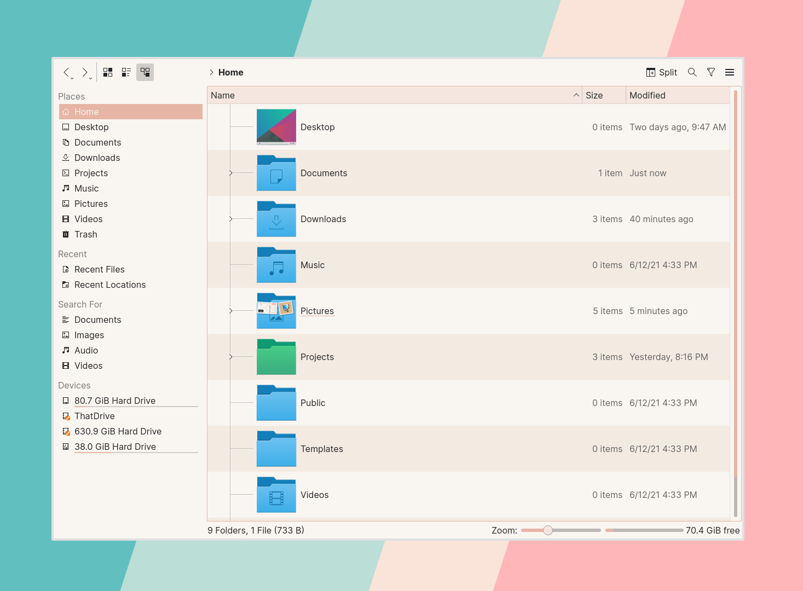
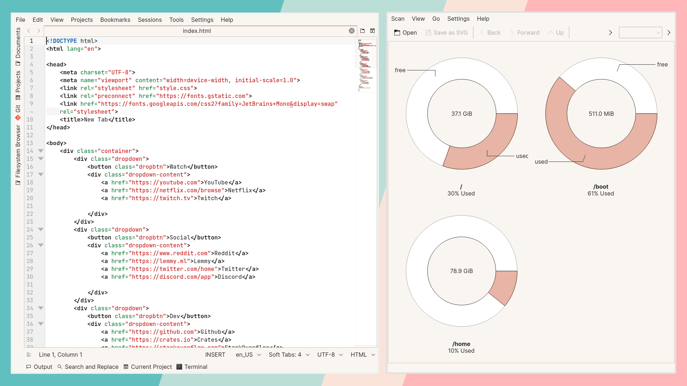
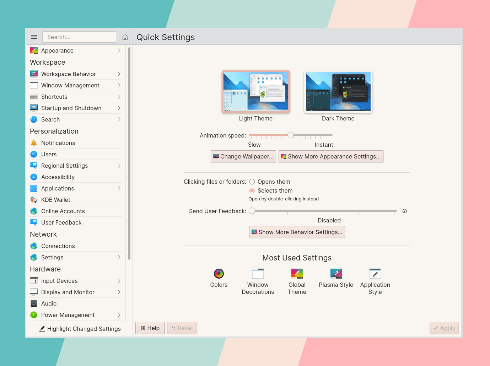
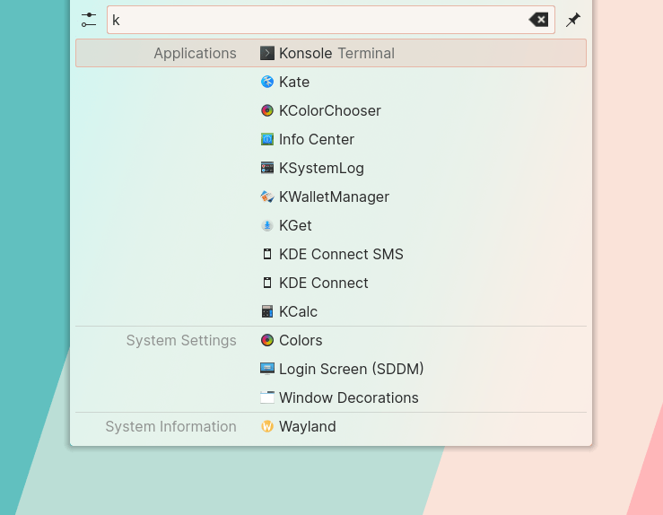

# Linen for KDE

## Installation

### Manually

1. Move `Linen.colors` to `~/.local/share/color-schemes`
2. Launch System Settings > Appearance > Colors > Select Linen > Click Apply.
3. In System Settings, go to Appearance > Global Theme > Select Breeze Light > Click Apply.

### KDE Store

Linen is [available in the KDE Store](https://store.kde.org/p/1539027/).

1. Launch System Settings > Appearance > Colors > Get New Color Schemes...
2. Search for "Linen" and click "Install".
3. Make sure to install the first entry as that is the latest one.
