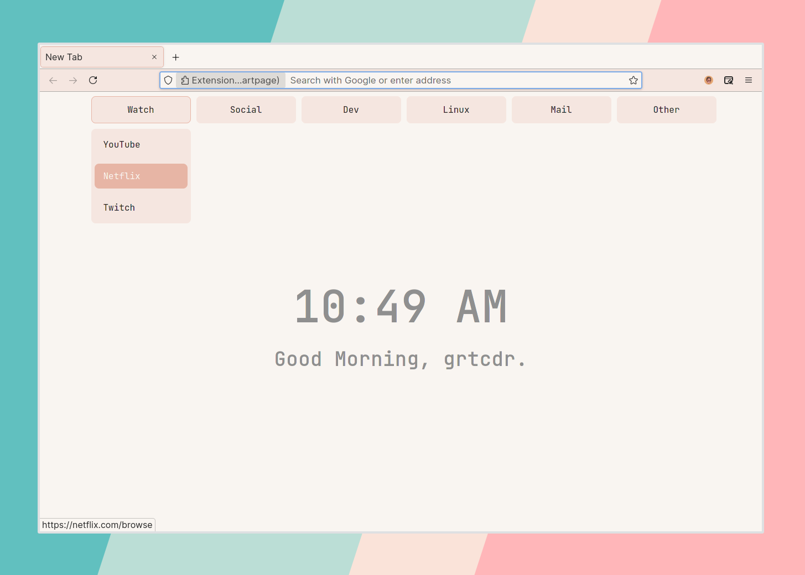

# Linen startpage



## Main features

- Quick access to your favorite websites
- Supports [web-ext](https://github.com/mozilla/web-ext), you can
  build this startpage into an extension.

## Customization

Jump inside the `src` directory and start modifying the appropriate files. 

Maybe you want to change the links? 
- They're inside `index.html`

Want your username to display next to the greeting?
- It's inside `script.js`

---

## Set startpage as new tab page

### Build & sign the extension

I use `web-ext` to build and sign my startpage extensions, please note
that any modifications you make to the startpages won't take effect
unless the extension is rebuilt.

Please note that _this is not the only way_ to set my startpages as a
new tab page, it is just the way I do it.

#### Prerequisites

- [web-ext](https://github.com/mozilla/web-ext)

Install from NPM:
```
npm install --global web-ext
```

Using GNU/Linux? It should be available in your distribution's
repositories.

#### Building the extension

In your terminal:

1. Clone the repository:
```
git clone https://github.com/grtcdr/startpages
```
2. Jump inside the repository:
```
cd startpages
```
3. Navigate inside the __src__ directory of your desired startpage.
Let's use _startpage_7_ as an example:
```
cd startpage_7/src
```
4. Sign the extension
```
web-ext sign --api-key=$AMO_JWT_ISSUER --api-secret=$AMO_JWT_SECRET
```

For more information on how to obtain your `api-key` and `api-secret`,
[read this guide by Mozilla.](https://extensionworkshop.com/documentation/develop/getting-started-with-web-ext/)
Signing an extension is talked about under _"Signing your extension
for self-distribution"_

If all goes well during the signing process, you will discover that a
new directory, `web-ext-artifacts` has appeared, and it contains a
file with the `xpi` extension.

5. Open Firefox, type `about:addons` in the search bar, drag and drop
   the `xpi` file into the window
6. Firefox will now prompt you to add the extension, click "Add"

You're good to go, the startpage will now appear every time you create
a new tab.
